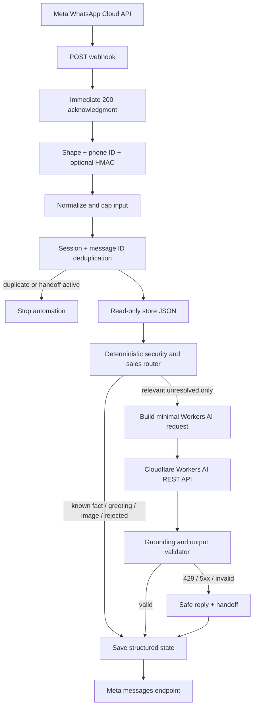

# Architecture

## Runtime flow



The GET verification webhook and protected clear-handoff webhook remain separate branches in the main workflow. Unexpected failures use the separate error-trigger workflow.

## Trust boundaries

1. **Untrusted customer data:** message text, image captions, button/list labels, headers, and profile/event metadata. Text is cleaned and capped before use. It cannot select a file, command, endpoint, credential, or model.
2. **Trusted business data:** `products.json`, `faq.json`, and `store-config.json`, mounted at fixed read-only paths under `/store-data`.
3. **Secrets:** Meta and Cloudflare tokens, Meta App Secret, webhook verify token, handoff token, and n8n encryption key. They come from environment variables or n8n credentials and never enter model context or ordinary logs.

The deterministic router is the policy boundary. Clearly irrelevant or adversarial input is answered there, before a Workers AI request can be built.

## Deterministic routing

The router performs, in order:

1. language detection;
2. data-driven product alias matching;
3. explicit security and out-of-scope rejection;
4. deterministic intent signals;
5. structured product/store/FAQ lookup;
6. direct response where the source-of-truth data is sufficient;
7. an `ai_needed` decision only for a relevant unresolved or interpretive question.

Product aliases live only in product data. Normalization lowercases text, removes basic punctuation and Latin diacritics, and collapses whitespace. Multiple explicit products produce a comparison only when the message contains comparison language; otherwise the bot asks for clarification.

## Workers AI adapter

Provider-specific behavior is isolated to the build, HTTP, and validation nodes. The current adapter calls:

```text
POST /client/v4/accounts/{account_id}/ai/run/{model}
```

Its input contract is:

```json
{
  "normalized_message": "customer user data",
  "language": "darija",
  "ai_context": {
    "products": [],
    "store": {}
  }
}
```

Only matched products and question-relevant store fields are included. The system message is fixed; customer text is a separate user-role JSON payload. The provider adapter returns:

```json
{
  "reply": "...",
  "should_handoff": false,
  "response_source": "cloudflare_ai",
  "ai_status": "success"
}
```

Failures return a localized deterministic reply, `response_source=deterministic`, and a handoff status. Replacing Cloudflare requires only a new adapter that preserves these contracts.

## Grounding controls

- The JSON catalogue/configuration is authoritative; the model is not a database.
- Only relevant matched records enter `ai_context`.
- Prices and other numeric claims must already appear in trusted context or the customer question.
- Unsupported size, color, material, warranty, promotion, authenticity, and waterproof claims are rejected.
- Credential/prompt/environment terminology in output is rejected.
- Invalid JSON, excessive output, a model-requested handoff, missing configuration, 429, and 5xx all fail closed to a safe handoff response.
- Output is capped at 700 characters and model generation at 64–512 tokens.

## Image boundary

Incoming images are treated as a supported message type so the customer receives a useful reply. No media is downloaded and no Media ID is stored or mapped to a product. Meta Media IDs can change across uploads and are not stable catalogue keys. V1 performs no vision inference and never sends an image to Workers AI.

If `last_product_id` is current, the bot may ask whether the image question concerns that product; it never claims the image itself established the identity.

## Persistence model

Workflow static data stores:

```text
sessions[phone_number]
  language
  last_intent
  last_product_id
  last_product_at
  last_seen
  human_handoff

processed_message_ids[message_id]
  received_at / processed_at
  phone_number
  status
  response_source
```

Product context is accepted for 24 hours, processed IDs expire after seven days, and inactive sessions expire after 90 days. The workflow does not keep or send an unbounded conversation transcript.

Static data is appropriate for one low-volume active workflow. It is not an atomic deduplication store for concurrent queue-mode workers. Before scaling, use a database uniqueness constraint on `(store_id, message_id)` and a bounded session record keyed by `(store_id, phone_number)`.

## Handoff and error behavior

Explicit human requests, returns/refunds, unknown live stock, and AI/provider failures set the handoff lock. Later events are recorded for deduplication but do not proceed to store routing or AI. Staff clears the lock through the timing-safe-token-protected admin webhook.

Unexpected n8n failures enter the error workflow. Logs contain workflow name, node, execution ID, timestamp, a redacted bounded error message, and only the final four phone digits. Stack traces, Authorization values, tokens, and complete customer phone numbers are not deliberately logged.
