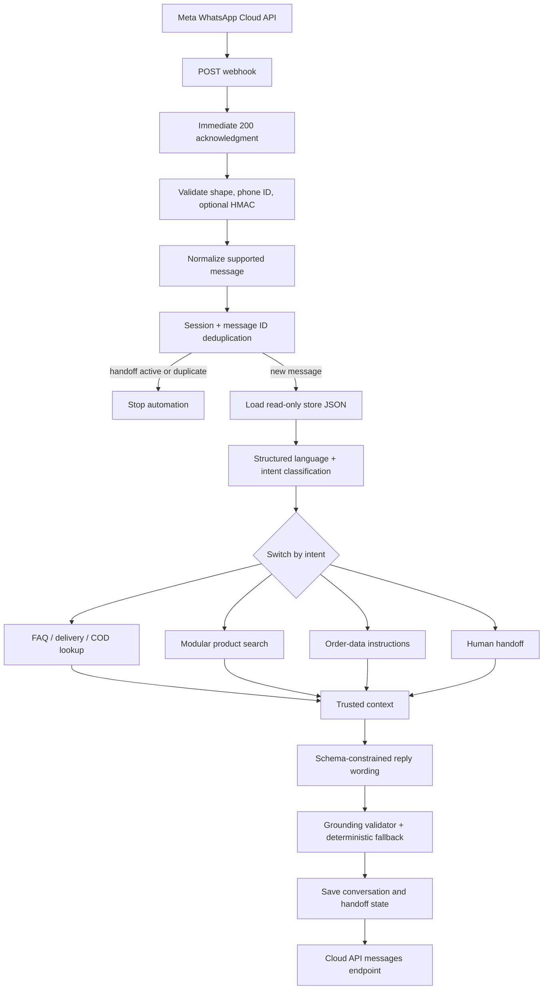

# Architecture

## Runtime flow



The GET verification webhook and protected clear-handoff webhook are separate branches in the same workflow. The error trigger is a separate workflow so unexpected failures cannot expose runtime details through the main webhook response.

## Trust boundaries

There are three data classes:

1. **Untrusted customer data**: message text, profile name, button/list labels, and webhook headers. Inputs are length-limited and the model is told never to obey instructions inside them.
2. **Trusted business data**: the three JSON files mounted read-only at `/store-data`. Only client-approved values belong here.
3. **Secrets**: Meta/AI-provider tokens, verification values, the App Secret, and the handoff admin token. These come from environment variables or n8n credentials and never enter prompts or logs.

The language model cannot turn customer text into trusted facts. Product and FAQ lookups create a small `trusted_context`, plus stable `trusted_source_ids`. The output validator accepts only those source IDs and rejects unsupported numeric claims.

## Supported classification schema

```json
{
  "language": "darija",
  "intent": "product_price",
  "product_query": "Jagwar glasses",
  "attributes": {
    "color": null,
    "size": null,
    "quantity": null
  },
  "needs_human": false,
  "confidence": 0.95
}
```

Languages are `darija`, `french`, `english`, and `unknown`. Intents are `greeting`, `faq`, `product_search`, `product_price`, `product_availability`, `delivery`, `cod`, `recommendation`, `order`, `human_support`, and `unknown`.

If the AI classifier is unavailable or invalid, deterministic keyword classification keeps the flow safe. Low confidence and unknown intent always escalate.

## Product search boundary

`Modular Product Search` currently performs normalized token matching over the mounted JSON catalogue and returns at most three complete product records. Generic terms such as “glasses” or “price” do not produce a model match on their own; a model or audience term is needed. A generic recommendation may return listed products whose stock is not explicitly zero, but the reply never claims availability when stock is unknown.

To replace the catalogue:

1. Replace `Load Store Data` and/or `Modular Product Search` with a Shopify, Google Sheets, PostgreSQL, Airtable, or HTTP node.
2. Keep the output contract: `product_results`, `trusted_context`, `trusted_source_ids`, and `needs_human`.
3. Return exact source values; do not summarize them with AI before validation.
4. Run the scenario and regression tests against known products and missing products.

## Persistence model

The MVP uses n8n workflow static data because it needs no additional infrastructure. It stores:

```text
sessions[phone_number]
  phone_number
  language
  last_intent
  recent_messages (last 12 user/assistant entries)
  last_seen
  human_handoff

processed_message_ids[message_id]
  received_at / processed_at
  phone_number
  status
```

Processed IDs expire after seven days; inactive sessions expire after 90 days. Static data persists only for successful production executions of an active workflow. It is appropriate for one low-volume MVP instance, but not concurrent queue-mode workers or multi-tenant deployments.

### PostgreSQL or Redis migration

- Create `customer_sessions` keyed by `(store_id, phone_number)`.
- Create `processed_messages` with a unique `(store_id, message_id)` constraint.
- Insert the message ID atomically before processing; treat a uniqueness conflict as a duplicate.
- Store recent messages in a bounded JSONB field or normalized messages table.
- Use Redis for short-lived locks/deduplication only if durable conversation history remains elsewhere.
- Replace the two static-data Code nodes and the admin clear node; the intent, lookup, AI, validation, and send contracts remain unchanged.

## Handoff lifecycle

An escalation sends one localized transfer message and sets the session lock. Later inbound events are deduplicated and appended to recent history, but they do not reach classification or AI. Staff clears the lock through the protected webhook after resolving the conversation. A future human-agent dashboard can call this endpoint or replace it with a database update.

## Error behavior

Expected AI failures use deterministic fallbacks in the main workflow. Unexpected n8n errors enter the error workflow, which logs workflow name, failed node, customer number when recoverable, timestamp, execution ID, and a bounded error message. It never sends stack traces or workflow details to the customer. A localized customer fallback is sent only when a phone number is available and the failed node was not already the WhatsApp send node.
